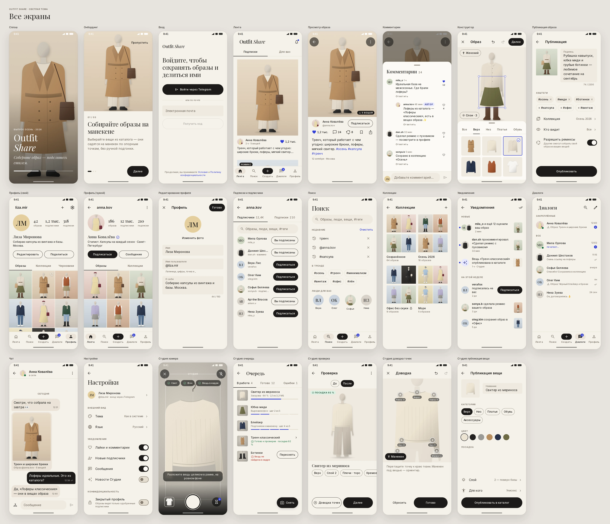
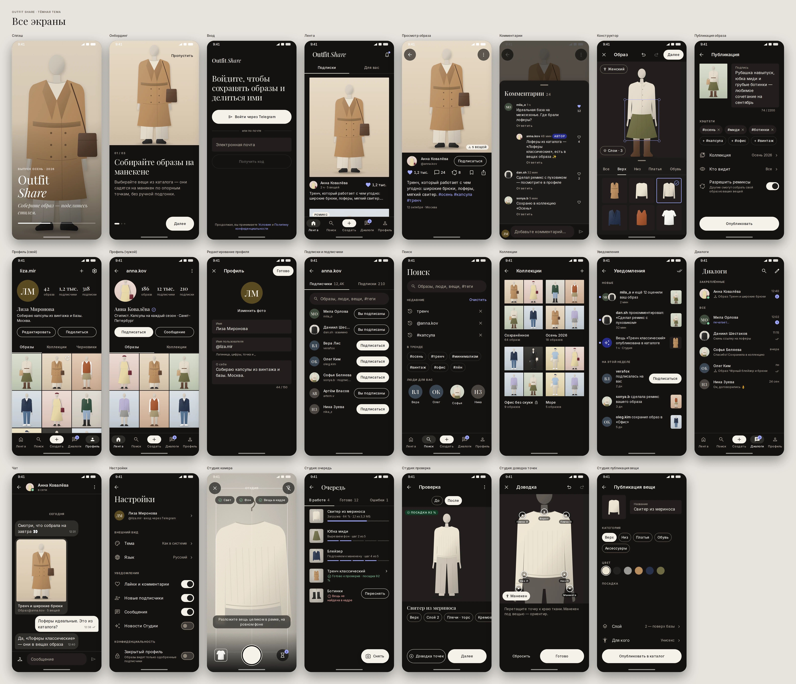

# Outfit Share — дизайн-система «Atelier»

Редакционный fashion-журнал в телефоне: много воздуха, крупная антиква в заголовках, фотография
образа — главный герой, интерфейс вокруг неё — монохромный и не спорит с одеждой.



<details>
<summary>Тёмная тема</summary>



</details>

## Принципы

1. **Фото — герой.** Образ показывается 4:5 на всю ширину колонки, почти без скругления (2 dp), без
   рамок и подложек. Над фото — только круглые кнопки на полупрозрачной подложке `photoScrim`:
   контраст не зависит от снимка.
2. **Монохром + один акцент.** Молочный, графит, тёплый серый. Главное действие — графитовая кнопка
   днём и молочная ночью. Фирменный **ультрамарин** появляется только в «моментах»: лайк,
   непрочитанное, ссылка, фокус, snap к манекену, прогресс.
3. **Журнальная типографика.** Антиква *OutfitShare Display* (производная Playfair Display) — заголовки,
   числа, инициалы; Inter — интерфейс. Кикеры — капсом с разрядкой.
4. **Воздух по сетке 4/8 dp.** Поля экрана 20 dp (32 на планшете), секции — 40 dp. В разметке нет
   «магических» чисел — только токены; это проверяет JVM-тест модуля.
5. **Движение с весом.** Пружины из `androidx.dynamicanimation` для физических действий (вещь
   «падает» на манекен, сердце), кривые emphasized для переходов, shared element «карточка → образ».
   Хаптика — только на ключевых действиях: snap, лайк, публикация, затвор.
6. **Доступно по умолчанию.** WCAG AA для 102 пар цветов в обеих темах, зоны касания ≥ 48 dp,
   contentDescription и роли у всех интерактивных элементов, шрифт до 200 % без поломок, уважение к
   «Убрать анимации».

## Что где лежит

| Путь | Что это |
|---|---|
| [`tokens/tokens.json`](tokens/tokens.json) | **Единственный источник** токенов: цвет, типографика, отступы, размеры, радиусы, elevation, движение, хаптика |
| [`tokens/README.md`](tokens/README.md) | Сгенерированные таблицы токенов и отчёт по контрасту |
| [`foundations.md`](foundations.md) | Цвет, шрифты (выбор, кириллица, лицензии), сетка, формы, иконки, иллюстрации, фотография |
| [`components.md`](components.md) | Компоненты: назначение, варианты, состояния, доступность, API в Android |
| [`motion.md`](motion.md) | Длительности, кривые, пружины, shared element, «падение» вещи, сердце, хаптика |
| [`accessibility.md`](accessibility.md) | Контраст, зоны касания, TalkBack, шрифт 200 %, анимации — и как это проверяется |
| [`screens.md`](screens.md) | Карта экранов, матрица состояний, доски всех экранов (светлая/тёмная/состояния/200 %) |
| [`screenshots/`](screenshots) | Отрендеренные доски (WebP) и анимации (GIF) |
| [`mockups/`](mockups) | Исходники макетов: HTML/CSS/JS на тех же токенах, рендер скриншотов |
| [`illustrations/`](illustrations) | SVG-превью иллюстраций пустых состояний |
| [`../../android/core/designsystem`](../../android/core/designsystem) | Модуль **`:core:designsystem`** (Java, View + Material Components 3) |
| [`../../tools/designsystem`](../../tools/designsystem) | Генераторы: токены, шрифты, иконки, иллюстрации, упаковка скриншотов |

## Как пользоваться в Android

```kotlin
// settings.gradle.kts приложения уже включает модуль; в app/build.gradle.kts:
dependencies { implementation(project(":core:designsystem")) }
```

```xml
<!-- AndroidManifest.xml: тема приложения и системный сплэш -->
<application android:theme="@style/Theme.Ds.Starting"> … </application>
```

```xml
<!-- Разметка экрана: только токены и компоненты дизайн-системы -->
<LinearLayout
    android:layout_width="match_parent"
    android:layout_height="wrap_content"
    android:orientation="vertical"
    android:paddingStart="@dimen/ds_layout_gutter"
    android:paddingEnd="@dimen/ds_layout_gutter">

    <TextView style="@style/Widget.Ds.Text.Kicker" android:text="@string/feed_kicker" />

    <app.outfitshare.core.designsystem.component.card.OutfitCardView
        android:id="@+id/card"
        android:layout_width="match_parent"
        android:layout_height="wrap_content"
        android:layout_marginTop="@dimen/ds_space_4" />

    <com.google.android.material.button.MaterialButton
        style="@style/Widget.Ds.Button.Primary.Large"
        android:layout_width="match_parent"
        android:layout_height="wrap_content"
        android:text="@string/publish" />
</LinearLayout>
```

```java
card.setAuthor(outfit.authorId, outfit.authorName, getString(R.string.feed_meta, hours, items));
card.setCaption(outfit.caption);
card.setLiked(outfit.liked, outfit.likes);
card.setDoubleTapToLike(true);
card.setOnLikeChangeListener((button, liked) -> viewModel.toggleLike(outfit.id, liked));
card.setSharedElementName(SharedElements.outfitPhoto(outfit.id));

stateView.setState(ScreenState.error());               // «Не получилось загрузить» + «Повторить»
DsSnackbar.undo(root, getString(R.string.comment_deleted), vm::restore, vm::commitDelete);
Haptics.perform(canvas, Haptics.Event.SNAP);
```

Цвета — только через атрибуты темы (`?attr/dsColorAccent`) или `@color/ds_color_*`, никогда HEX в
разметке. Подробный API каждого компонента — в [`components.md`](components.md).

## Как обновлять

Все производные файлы генерируются; руками правятся только `tokens.json`, код компонентов и
макеты экранов.

```bash
# 1. Токены → Android-ресурсы, Java-константы, CSS, таблицы документации (+ проверка контраста)
python3 tools/designsystem/generate_tokens.py            # --check в CI: всё ли актуально

# 2. Иллюстрации → VectorDrawable, SVG, JS для макетов
python3 tools/designsystem/illustrations.py

# 3. Шрифты (редко): инстансы и сабсеты Playfair Display / Inter, pip install fonttools brotli
python3 tools/designsystem/build_fonts.py

# 4. Иконки (редко): Material Symbols Outlined wght 300
python3 tools/designsystem/fetch_icons.py

# 5. Скриншоты экранов, компонентов и анимаций (нужен Playwright с Chromium, pip install pillow)
node docs/design/mockups/render.mjs && python3 tools/designsystem/pack_screenshots.py

# Тесты генератора и JVM-тесты модуля
python3 -m pytest tools/designsystem/tests
cd android && ./gradlew :core:designsystem:testDebugUnitTest :core:designsystem:lint spotlessCheck
```

Макеты открываются локально без сборки: [`mockups/board.html`](mockups/board.html) (все экраны и
доски по `?screen=feed`), [`mockups/components.html`](mockups/components.html),
[`mockups/motion.html`](mockups/motion.html).

## Что проверяется автоматически

| Правило | Где |
|---|---|
| Контраст WCAG AA (текст ≥ 4.5, UI ≥ 3) для 102 пар в обеих темах + палитра аватаров | `generate_tokens.py` (падает при нарушении), `DesignSystemResourcesTest` |
| Сгенерированные файлы соответствуют `tokens.json` | `generate_tokens.py --check`, `illustrations.py --check`, pytest |
| Нет литеральных dp/sp/px в layout-, style-, shape-файлах модуля | `DesignSystemResourcesTest.layoutsAndStylesUseTokensInsteadOfLiteralSizes` |
| Кнопки, чипы, лайк, переключатели, строки ≥ 48 dp | `DesignSystemResourcesTest.interactiveComponentsMeetTouchTarget` |
| Текст только в sp, отступы по сетке 4 dp | `DesignSystemResourcesTest`, `test_generate_tokens.py` |
| Логика компонентов: инициалы, цвет аватара, пропорции, счётчики, хаптика, состояния | JVM-тесты модуля (27 тестов) |
| Стиль кода | Spotless (google-java-format), Checkstyle (Google Checks), Android Lint с ошибками доступности |

## Состояние и ограничения

* Макеты экранов — HTML на тех же токенах, шрифтах, иконках и иллюстрациях, что и модуль; это
  спецификация для фаз 3–6. Экранов Android в этом шаге нет — только дизайн-система.
* Среда, в которой создавался модуль, не имела доступа к Google Maven (`dl.google.com`), поэтому
  Gradle-сборку с AGP здесь выполнить было нельзя. Проверено иначе: весь Java-код компилируется
  `javac` против Android 16 (API 36, `android-all` из Maven Central) с заглушками сигнатур
  AndroidX/Material и сгенерированным `R`; JVM-тесты (27) проходят; код отформатирован
  google-java-format 1.28 и чист по Checkstyle; все ссылки между ресурсами разрешаются. Версии AGP
  и AndroidX в [`libs.versions.toml`](../../android/gradle/libs.versions.toml) нужно подтвердить
  при первой синхронизации в Android Studio.
