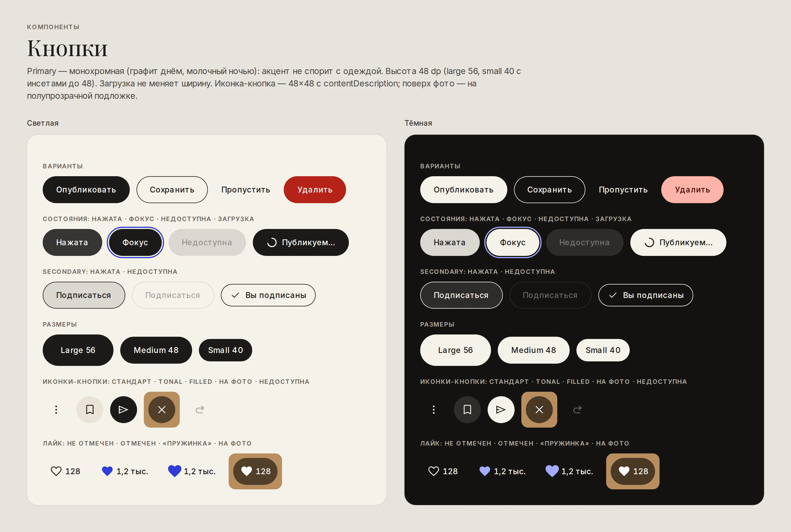
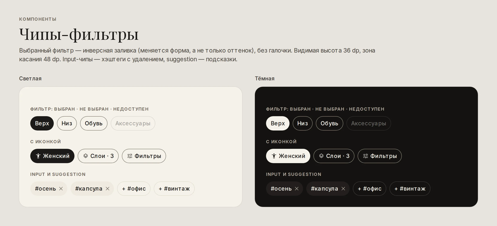
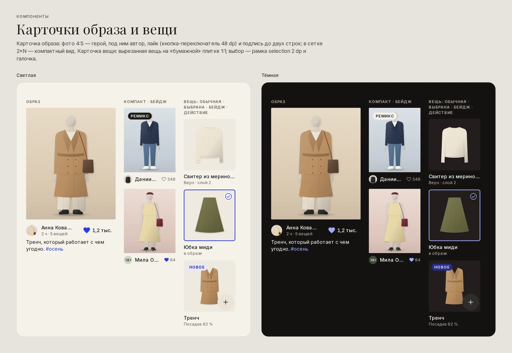
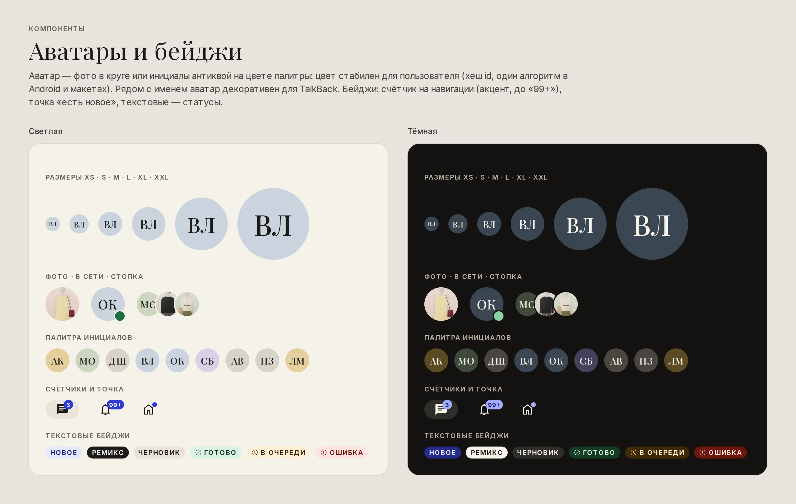
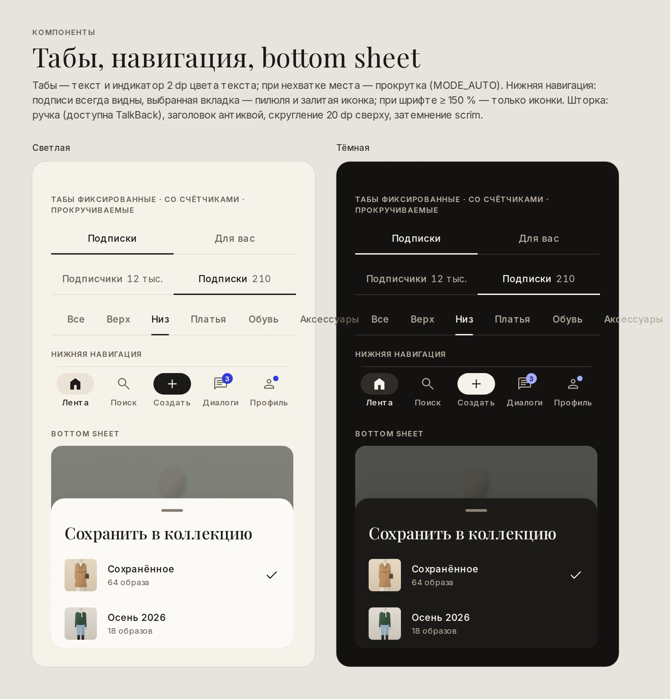
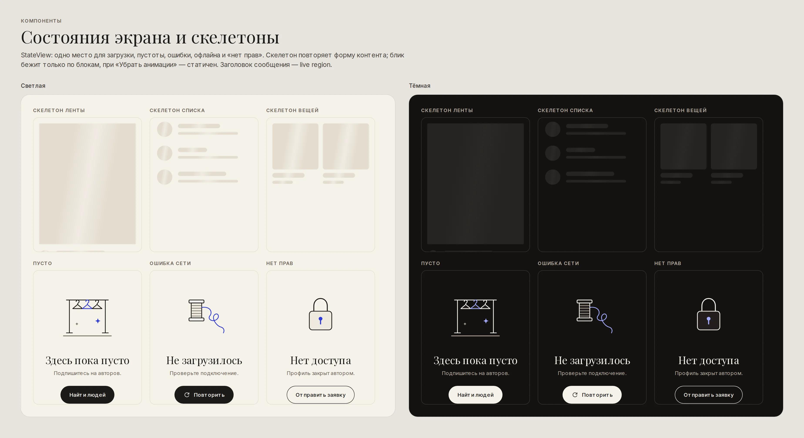
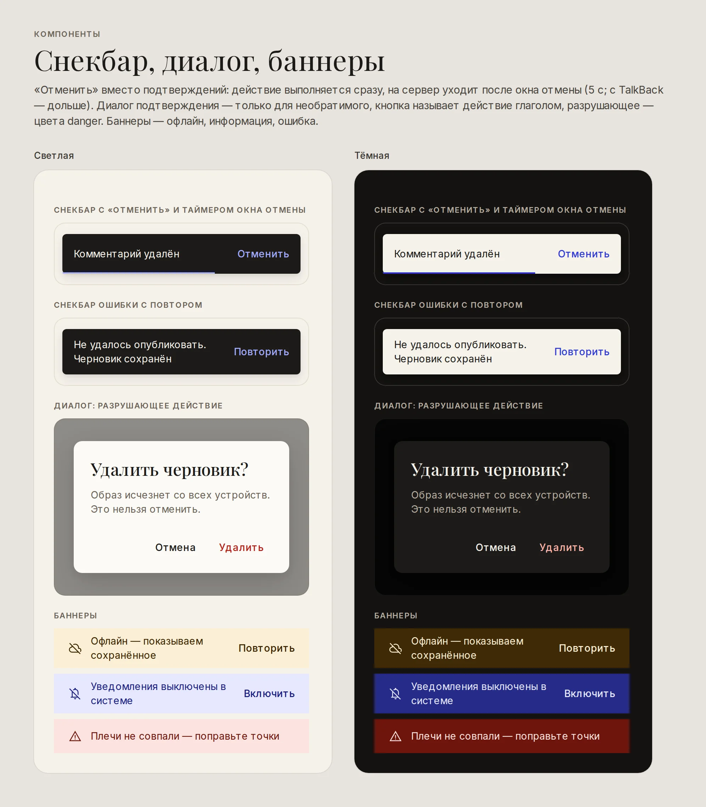
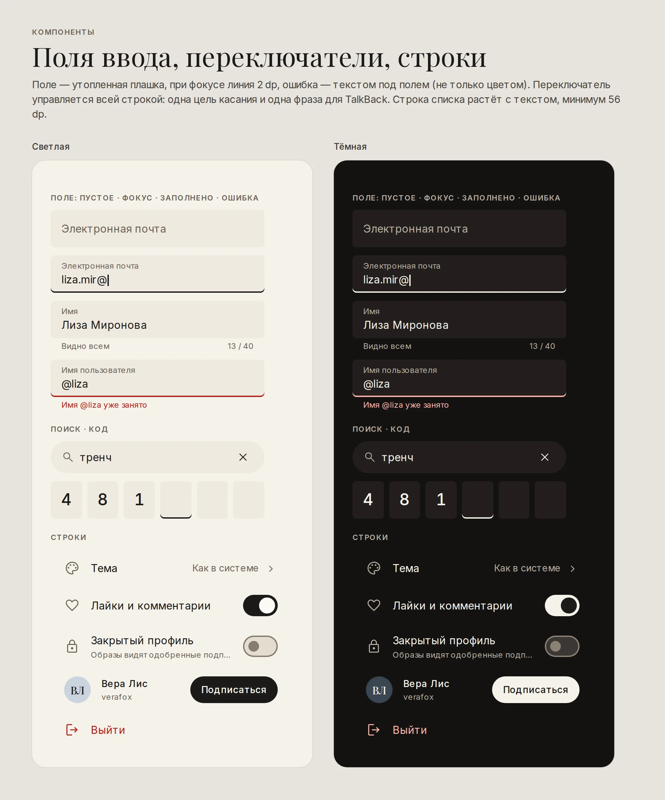

# Компоненты

Модуль `:core:designsystem` — Java, View + Material Components 3. Пакет
`app.outfitshare.core.designsystem`. Стандартные виджеты Material (кнопки, чипы, табы, поля,
навигация, шторки, снекбары, диалоги) получают стиль из темы `Theme.Ds` автоматически; для того, чего
в Material нет, — собственные компоненты в `component.*`. Каждый компонент задаётся стилем по
умолчанию через атрибут темы (`dsOutfitCardStyle`, `dsAvatarStyle`…), поэтому его можно
перестилизовать для отдельного экрана без правки кода.

| Компонент | Android | Макет |
|---|---|---|
| Кнопки primary / secondary / ghost / danger / icon | `Widget.Ds.Button.*`, `DsButton` | [доска](screenshots/components/components-buttons.webp) |
| Чипы-фильтры, input, suggestion | `Widget.Ds.Chip.*`, `FilterChipGroup` | [доска](screenshots/components/components-chips.webp) |
| Карточка образа | `OutfitCardView` | [доска](screenshots/components/components-cards.webp) |
| Карточка вещи | `ItemCardView` | [доска](screenshots/components/components-cards.webp) |
| Аватар | `AvatarView` | [доска](screenshots/components/components-avatars-badges.webp) |
| Лайк | `LikeButton` | [доска](screenshots/components/components-buttons.webp) |
| Bottom sheet | `DsBottomSheetDialogFragment` | [доска](screenshots/components/components-navigation.webp) |
| Табы, нижняя навигация | `Widget.Ds.TabLayout*`, `Widget.Ds.BottomNavigation`, `NavigationBars` | [доска](screenshots/components/components-navigation.webp) |
| Пустые состояния, ошибки, офлайн, нет прав | `StateView`, `ScreenState`, `OfflineBanner` | [доска](screenshots/components/components-states.webp) |
| Скелетоны | `SkeletonLayout`, `ds_skeleton_*` | [доска](screenshots/components/components-states.webp) |
| Снекбар «Отменить» | `DsSnackbar` | [доска](screenshots/components/components-feedback.webp) |
| Диалог подтверждения | `ConfirmDialog` | [доска](screenshots/components/components-feedback.webp) |
| Бейджи | `Badges`, `Widget.Ds.TextBadge.*` | [доска](screenshots/components/components-avatars-badges.webp) |
| Поля, переключатели, строки списков | `Widget.Ds.TextInputLayout*`, `ListRowView` | [доска](screenshots/components/components-inputs.webp) |
| Фото с пропорциями | `AspectRatioImageView` | — |
| Движение и хаптика | `Motion`, `DropAnimation`, `HeartBurst`, `SharedElements`, `Haptics` | [motion.md](motion.md) |

---

## Кнопки



| Вариант | Стиль | Когда |
|---|---|---|
| Primary | `Widget.Ds.Button.Primary` (+ `.Large` 56, `.Small` 40) | Одно главное действие экрана: «Опубликовать», «Далее», «Подписаться» |
| Secondary | `Widget.Ds.Button.Secondary` (+ `.Small`) | Равноправная альтернатива: «Сообщение», «Редактировать», «Вы подписаны» |
| Ghost | `Widget.Ds.Button.Ghost` | Третичное: «Пропустить», «Отправить новый код», действия диалога |
| Danger | `Widget.Ds.Button.Danger`, `Widget.Ds.Button.Ghost.Danger` | Разрушающее действие после подтверждения |
| Icon | `Widget.Ds.Button.Icon` (+ `.Filled`, `.Tonal`, `.OnPhoto`) | 48×48, иконка 24; `contentDescription` обязателен |
| Затвор | `Widget.Ds.Button.Shutter` | Только камера Студии, 72 dp |

* Primary монохромна: графит днём, молочный ночью. Акцент в кнопках не используется.
* Высота 48 dp = зона касания, поэтому инсеты нулевые; small — 40 dp визуально + инсеты до 48.
* Подпись до двух строк: при шрифте 200 % кнопка растёт, а не обрезает текст.
* Загрузка — `DsButton.setLoading(true)`: индикатор встаёт на место иконки, текст остаётся (ширина не
  прыгает), нажатия блокируются, TalkBack слышит состояние «Загрузка…».

```xml
<app.outfitshare.core.designsystem.component.button.DsButton
    android:id="@+id/publish"
    style="@style/Widget.Ds.Button.Primary.Large"
    android:layout_width="match_parent"
    android:layout_height="wrap_content"
    android:text="@string/publish" />
```

## Чипы-фильтры



* Выбранный фильтр — **инверсная заливка** (primary), невыбранный — контур `outline`. Меняется форма
  заливки, а не только оттенок, поэтому галочка не нужна.
* Видимая высота 36 dp, `chipMinTouchTargetSize` 48 dp.
* `FilterChipGroup` — одиночный выбор с обязательным выбранным: `setFilters(list, selectedId)`,
  `setOnFilterSelectedListener(id -> …)`. Кладётся в `HorizontalScrollView`.
* `Widget.Ds.Chip.Input` — хэштеги в публикации (с крестиком), `Widget.Ds.Chip.Suggestion` — подсказки.

## Карточка образа — `OutfitCardView`



Анатомия: фото 4:5 (`AspectRatioImageView`) → бейдж поверх фото («Ремикс», «Новое») → строка автора
(аватар S, имя, мета) и `LikeButton` → подпись до двух строк.

| API | Назначение |
|---|---|
| `getPhotoView()` | Картинку кладёт загрузчик изображений приложения |
| `setAuthor(id, name, meta)` | Имя, мета («2 ч · 5 вещей»), аватар-инициалы по id |
| `setCaption(text)`, `setBadge(text)` | Подпись и бейдж |
| `setLiked(liked, count)` | Состояние с сервера (без анимации) |
| `setOnLikeChangeListener(l)` | Лайк кнопкой **и** двойным тапом |
| `setDoubleTapToLike(true)` | Двойной тап по фото → лайк + `HeartBurst`; одиночный тап подтверждается после таймаута двойного |
| `setSharedElementName(SharedElements.outfitPhoto(id))` | Для перехода в просмотр образа |
| `setOnOpenComments(r)` | Доступное действие «Комментарии» |
| `recycle()` | Сброс перед переиспользованием в RecyclerView |

Доступность: карточка читается одной фразой («Образ от Анны Ковалёвой. Ремикс. Подпись…»), аватар
декоративен, лайк — отдельный переключатель, жест двойного тапа продублирован действием
«Нравится / Убрать отметку». Нажатие — лёгкое «вдавливание» (`@animator/ds_press_scale`), фокус с
клавиатуры — кольцо `focusRing`. При шрифте ≥ 150 % имя и мета получают вторую строку.

## Карточка вещи — `ItemCardView`

Вырезанная вещь на плитке `surfaceSunken` 1:1 с отступом 12 dp, название и подпись. Режимы:

* просмотр (тап — карточка вещи);
* выбор — `setCheckable(true)`, `Checkable`: рамка `selection` 2 dp **и** галочка; для TalkBack —
  флажок «выбрано / не выбрано»;
* быстрое действие «+» — `setOnActionClickListener(…)` (иконка-кнопка 48 dp с описанием);
* бейдж — `setBadge("92 %")`, `"Новое"`, статус очереди Студии.

## Аватар — `AvatarView`



* Размеры `app:dsAvatarSize="xs|s|m|l|xl|xxl"` = 24/32/40/56/88/120 dp.
* Фото — через `setImageDrawable` загрузчиком; без фото — **инициалы антиквой** на цвете палитры
  `color.avatar.palette`. Цвет стабилен: `AvatarPalette.indexFor(userId, 7)` (мультипликативный хеш,
  тот же алгоритм в макетах). Контраст инициалов с каждым цветом ≥ 4.5:1 в обеих темах.
* `Initials.of("Анна Петрова")` → «АП», `"@nikita_style"` → «NS»; эмодзи пропускаются.
* `app:dsAvatarShowOnline` — точка `success` с кольцом цвета фона; в описании — «, в сети».
* `app:dsAvatarDecorative="true"` рядом с именем: TalkBack не читает имя дважды.

## Лайк — `LikeButton`

* Оптимистичный переключатель: состояние меняется сразу, приложение получает
  `onLikeChanged(button, liked)` и шлёт запрос; при ошибке — `setLiked(прежнее, count)`.
* Лайк — «пружинка» иконки ×1.25 → 1 (пружина `heart`) и хаптика `LIKE`; снятие — без вибрации.
* Счётчик — `CountFormatter`: 999 → «999», 1 234 → «1,2 тыс.», 1 250 000 → «1,2 млн»; округление вниз.
* Роль переключателя, состояние «отмечено/не отмечено», в описании — число отметок с правильным
  плюралом.
* `app:dsLikeOnPhoto="true"` — белое сердце на полупрозрачной подложке поверх фото.

## Bottom sheet — `DsBottomSheetDialogFragment`



Наследник задаёт `getSheetTitle()` и `onCreateSheetContent(…)`; каркас даёт ручку
`BottomSheetDragHandleView` (доступна TalkBack: «свернуть/развернуть»), заголовок антиквой и
контейнер. Тема: поверхность `surface`, скругление 20 dp сверху, затемнение `scrim`
(0.48 днём / 0.64 ночью), ширина на планшете ≤ 640 dp, edge-to-edge. Используется для комментариев,
«Ещё» у образа, выбора коллекции и темы, слоёв конструктора, фото профиля.

## Табы и нижняя навигация

* `Widget.Ds.TabLayout` — текст и индикатор 2 dp цвета текста; `tabMode="auto"`: на всю ширину, а
  при нехватке места (крупный шрифт) — прокрутка. `.Scrollable` — для категорий каталога.
* `Widget.Ds.BottomNavigation` — пять вкладок, подписи всегда видны, выбранная — пилюля
  `surfaceContainerHigh` и залитая иконка (`ds_ic_nav_*`). `NavigationBars.applyDesignSystemRules(bar)`
  при шрифте ≥ 150 % переключает навигацию на иконки (названия — TalkBack и подсказка по долгому
  нажатию).
* `Badges.setCount(bar, R.id.chats, 3)` — счётчик акцентного цвета до «99+», TalkBack: «3
  непрочитанных»; `Badges.setDot(…)` — точка «есть новое».

## Состояния экрана — `StateView` и `ScreenState`



Один компонент поверх контента для шести состояний: `CONTENT` (скрыт), `LOADING` (скелетон из
`app:dsLoadingLayout` или индикатор), `EMPTY`, `ERROR`, `OFFLINE`, `NO_PERMISSION`.

```java
stateView.setState(ScreenState.loading());
stateView.setState(ScreenState.builder(ScreenState.Kind.EMPTY)
    .illustration(R.drawable.ds_illustration_empty_feed)
    .title(getString(R.string.feed_empty_title))
    .message(getString(R.string.feed_empty_message))
    .action(getString(R.string.feed_empty_action))
    .build());
stateView.setState(ScreenState.error());   // «Не получилось загрузить» + «Повторить»
stateView.setOnActionClickListener(v -> viewModel.retry());
```

Для `ERROR`, `OFFLINE`, `NO_PERMISSION` иллюстрация, тексты и действие подставляются по умолчанию.
Сообщение прокручивается (шрифт 200 % не обрезает текст), заголовок — heading и live region, смена
состояний — кроссфейд 150 мс.

**Офлайн с кэшем** — не `StateView`, а `OfflineBanner` над сохранённым контентом: «Офлайн —
показываем сохранённое» + «Повторить»; при возврате сети баннер говорит «Снова в сети» и уезжает.

## Скелетоны — `SkeletonLayout`

Блоки `ds_bg_skeleton_block|line|circle|tile` повторяют форму контента; готовые разметки —
`ds_skeleton_outfit_card`, `ds_skeleton_list_row`, `ds_skeleton_item_card`. Блик
`skeletonHighlight` рисуется режимом `SRC_ATOP` в аппаратном слое — только по блокам, фон не
засвечивается; цикл 1400 мс; при «Убрать анимации» скелетон статичен. Для TalkBack весь скелетон —
один элемент «Загрузка…».

## Снекбар «Отменить» — `DsSnackbar`



```java
adapter.remove(comment);                       // интерфейс — сразу
DsSnackbar.undo(root, getString(R.string.comment_deleted),
    () -> adapter.restore(comment),            // «Отменить»
    () -> viewModel.deleteComment(comment.id)); // окно отмены истекло — на сервер
```

Окно отмены — `duration.undoWindow` (5 с); при включённом TalkBack Material продлевает его по
системной рекомендации. `DsSnackbar.error(view, text, retry)` — ошибка с «Повторить» и хаптикой
`REJECT`; `DsSnackbar.message(…)` — информационный.

## Диалог подтверждения — `ConfirmDialog`

Только для необратимого без «Отменить»: выход, удаление аккаунта, блокировка. Заголовок — вопрос
антиквой, кнопка — глагол действия, разрушающее — цвета `danger`:

```java
ConfirmDialog.with(context)
    .title(getString(R.string.logout_title))
    .message(getString(R.string.logout_message))
    .confirm(getString(R.string.logout))
    .destructive()
    .onConfirm(viewModel::logout)
    .show();
```

## Бейджи

* Счётчик и точка на навигации — `Badges` (см. выше).
* Текстовые — `TextView` со стилем `Widget.Ds.TextBadge` и вариантами `.Accent` («Новое»),
  `.Inverse` («Ремикс» поверх фото), `.Success` («Готово»), `.Warning` («В очереди»), `.Danger`
  («Ошибка»). Капс с разрядкой, высота 20 dp; статус всегда с текстом, иконка — дополнение.

## Поля, переключатели, строки



* `Widget.Ds.TextInputLayout` — утопленная плашка `surfaceSunken`, при фокусе линия 2 dp, ошибка —
  текстом под полем + линия `danger`, счётчик символов; `.Search` — пилюля с лупой и очисткой;
  `.Composer` — поле сообщения/комментария.
* `ListRowView` — строка списка: иконка или аватар, заголовок/подзаголовок, значение, trailing-вид,
  шеврон; `setDestructive(true)` для «Выйти». `setToggle(checked, listener)` превращает строку в
  переключатель, которым управляет **вся строка** (одна цель касания, TalkBack: «Лайки и
  комментарии, переключатель, включено»), с хаптикой `TOGGLE_ON/OFF`. Минимум 56 dp, текст
  переносится.

## Верхняя панель и тема

* `Widget.Ds.Toolbar` — плоская, на фоне экрана, заголовок Inter SemiBold 18; `.Editorial` —
  антиква 24 (Лента, Диалоги, Очередь).
* `Widget.Ds.CollapsingToolbar.Large` — большой заголовок 32 sp антиквой, схлопывается в панель.
* `Theme.Ds` — тема приложения, `Theme.Ds.Starting` — системный сплэш (знак-вешалка),
  `Theme.Ds.Camera` + `ThemeOverlay.Ds.Dark` — всегда тёмные экраны, `ThemeMode` —
  «Как в системе / Светлая / Тёмная» в настройках, `SystemBars` — edge-to-edge и инсеты.
