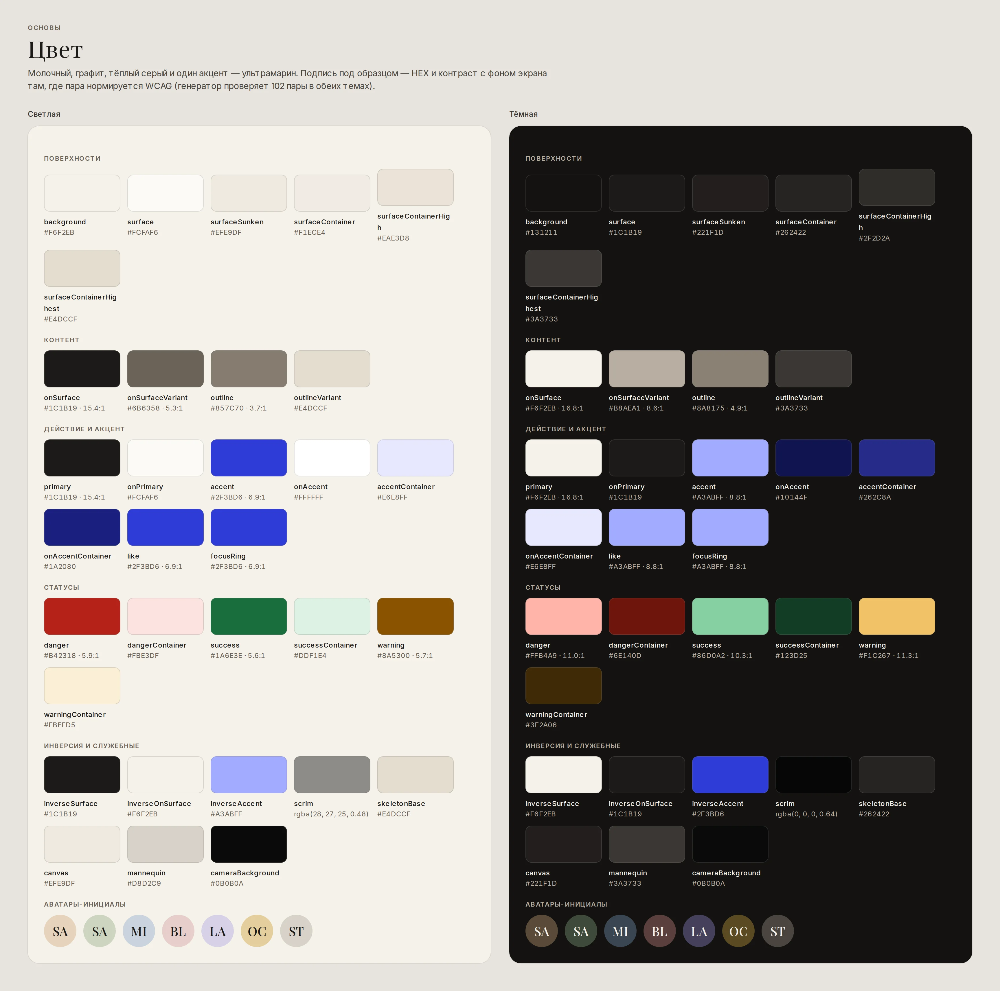
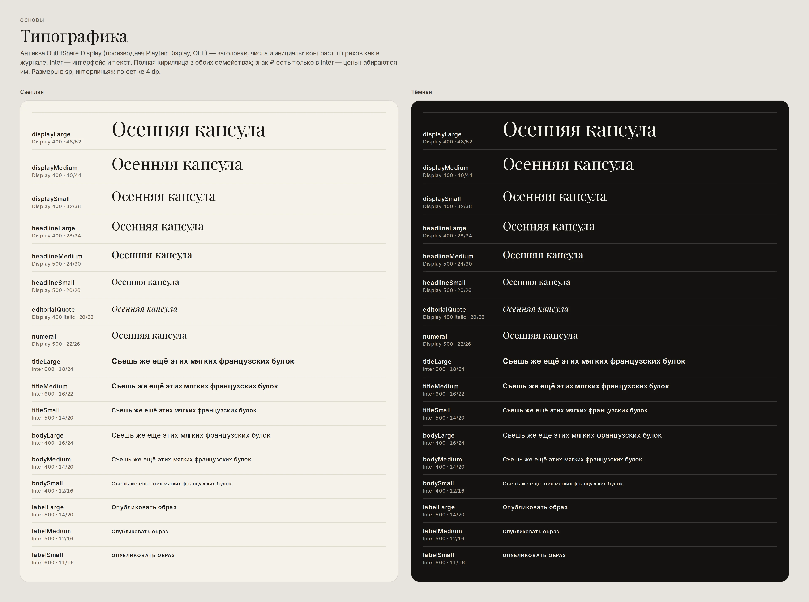
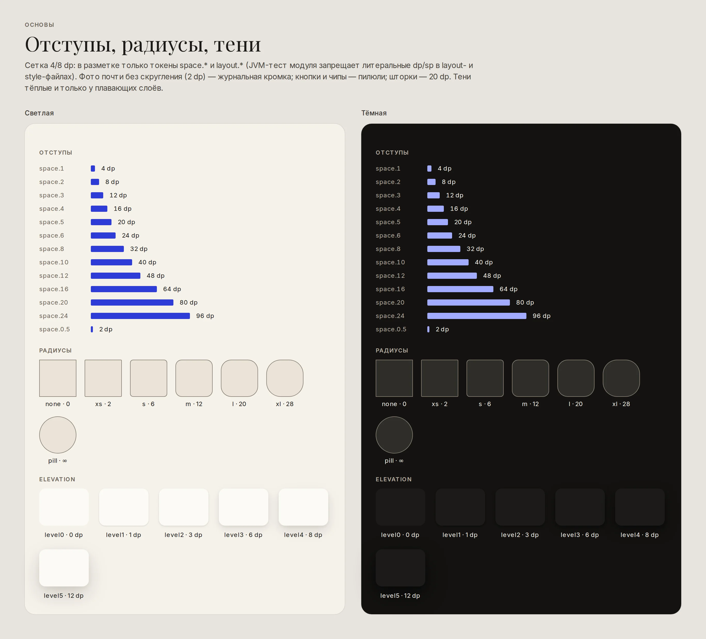
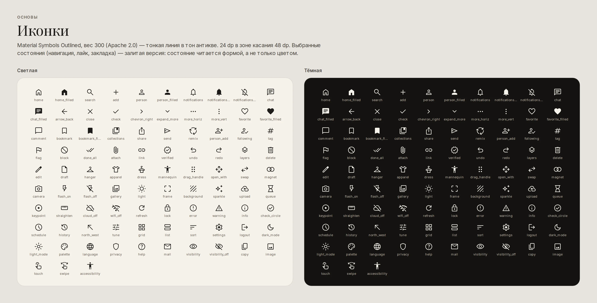
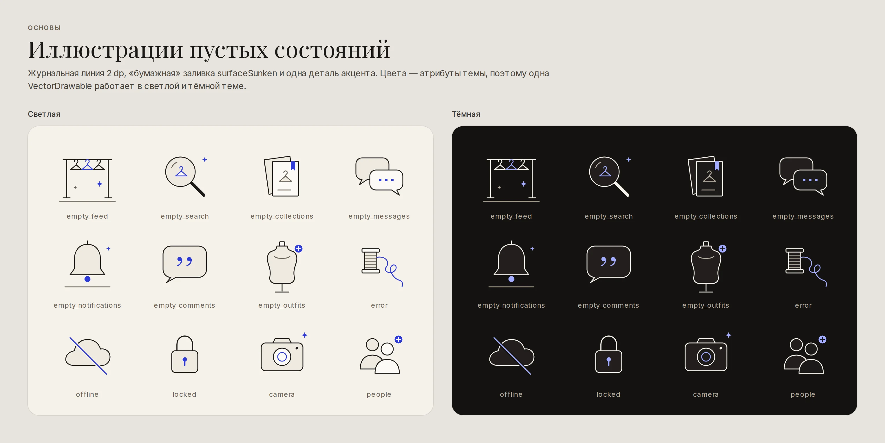

# Основы

Все значения — из [`tokens/tokens.json`](tokens/tokens.json); полные таблицы и отчёт по контрасту —
в [`tokens/README.md`](tokens/README.md).

## Цвет

**Идея.** Интерфейс — «бумага и типографская краска»: молочный фон, графитовый текст, тёплые серые
для вторичного. Одежда на фото приносит свой цвет, поэтому палитра интерфейса нейтральна, а
фирменный **ультрамарин** (`#2F3BD6` днём, `#A3ABFF` ночью) — комплементарен тёплым нейтралям фото
и появляется только в «моментах»:

| Где акцент | Почему |
|---|---|
| Лайк (`like`) | Главная эмоция продукта — бренд-момент |
| Непрочитанное: счётчики, точки | Сигнал, который должен выделяться из монохрома |
| Ссылки, хэштеги | Отличимы от текста не только цветом — ещё и контекстом `#` |
| Фокус (`focusRing`), выделение слоя (`selection`), snap-подсветка | Состояния конструктора и клавиатурной навигации |
| Прогресс загрузки | Живое действие |

Главные кнопки — **не** акцентные: primary — графит днём и молочный ночью. Так CTA не спорит с фото,
а акцент не «замыливается».

**Семантика, а не палитра.** Компоненты используют только семантические токены (`surface`,
`onSurfaceVariant`, `accent`, `danger`…). Android получает их трижды: `@color/ds_color_*`
(переключается квалификатором `-night`), атрибуты темы `?attr/dsColor*` и привязку к атрибутам
Material 3 (`colorPrimary`, `colorSurface*`, `colorError`…) — поэтому и собственные, и стандартные
Material-компоненты окрашиваются одинаково. Для экранов, которые всегда тёмные (камера Студии,
полноэкранное фото), есть `ThemeOverlay.Ds.Dark`.

**Тёмная тема** — не инверсия: фон — тёплый графит `#131211`, глубина передаётся тоном поверхностей
(`surfaceContainer*`), тени ослаблены; акцент и статусы осветлены до AA на тёмном.

**Контраст.** Генератор проверяет 102 пары (текст ≥ 4.5:1, элементы интерфейса ≥ 3:1) в обеих темах и
падает при нарушении. Самые «тесные» пары: вторичный текст на `surfaceContainerHigh` — 4.64:1,
контур на `surfaceContainerHigh` — 3.22:1 (светлая тема).

## Типографика

### Выбор шрифтов

Проверены четыре кандидата из Google Fonts (все — SIL OFL 1.1). Покрытие проверено по таблице cmap
файлов (fontTools): русский алфавит, типографские знаки «»—…№₽ и расширенная кириллица
(украинский, белорусский, казахский).

| Шрифт | Роль | Русский | Расширенная кириллица | ₽ | Решение |
|---|---|---|---|---|---|
| **Playfair Display** | заголовки | полный | полная | нет | ✅ Высококонтрастная антиква — голос журнала. Цены и суммы набираются Inter |
| **Inter** | интерфейс | полный | полная | есть | ✅ Нейтральный, отличные цифры (`tnum`), кириллица без компромиссов |
| Unbounded | заголовки (альтернатива) | полный | нет Қ Ғ Ң Ә Ө Ұ Ү Һ | есть | ✗ Широкий гротеск спорит с одеждой, нет казахских букв |
| Manrope | интерфейс (альтернатива) | полный | нет Қ Ғ Ң Ә Ұ | есть | Запасной вариант |

### Лицензии и сборка

* Шрифты вшиты в модуль (`res/font`), а не скачиваются: журнальная вёрстка не должна зависеть от
  Google Play Services и сети.
* [`build_fonts.py`](../../tools/designsystem/build_fonts.py) берёт вариативные исходники, сверяет
  SHA-256, делает статические начертания (Android надёжно выбирает вес только по отдельному файлу)
  и сабсетит до латиницы, кириллицы и типографских знаков — 782 КБ на шесть файлов вместо 1,45 МБ
  вариативных оригиналов (и без риска, что старые Android выберут не тот вес).
* У Playfair Display есть **Reserved Font Name**. По OFL 1.1 изменённая версия (а инстанс и сабсет —
  изменение) не может носить зарезервированное имя, поэтому производная называется
  **OutfitShare Display**; копирайт и текст лицензии сохранены в таблице `name`, полные тексты —
  в [`android/core/designsystem/licenses`](../../android/core/designsystem/licenses).

### Шкала

| Роль | Стиль | Где |
|---|---|---|
| Display L/M/S | антиква 48/40/32 | сплэш, онбординг, большие заголовки экранов, обложки коллекций |
| Headline L/M/S | антиква 28/24/20 | пустые состояния, диалоги и шторки, имена в профиле |
| Editorial quote | антиква курсив 20 | подписи-цитаты, подсказки на холсте |
| Numeral | антиква 22 | счётчики профиля |
| Title L/M/S | Inter 600/600/500 | заголовки панелей, имена, названия вещей |
| Body L/M/S | Inter 400 | текст, сообщения, мета |
| Label L/M/S | Inter 500/500/600, S — капсом с разрядкой 8 % | кнопки и табы, чипы, кикеры |

Размеры — в sp, интерлиньяж кратен 4 dp. При системном шрифте 200 % Android 14+ масштабирует
нелинейно: 14 sp → 26 dp, но 48 sp → 54 dp — крупные заголовки почти не растут, и вёрстка остаётся
журнальной (см. [`accessibility.md`](accessibility.md)).

## Сетка, отступы, формы, тени

* **Сетка 4/8 dp.** `space.1…24` = 4…96 dp; `space.0_5` = 2 dp — только для оптической подгонки
  иконок и бейджей.
* **Раскладка.** Поля экрана `layout.gutter` 20 dp (на ширине ≥ 600 dp — 32), зазор сетки 12,
  журнальный «воздух» между секциями 40. Читаемая колонка на планшете — не шире 640 dp.
* **Колонки.** Лента: 1 (compact) / 2 (medium) / 3 (expanded); сетки вещей и образов: 2 / 3 / 4.
  Профиль — плотная сетка 3×N с зазором 2 dp, как контакт-лист фотографа.
* **Формы.** Фото и карточки — 2 dp (журнальная кромка, не «плитки»), плитка вещи — 6, поля — 6,
  диалог — 12, шторка — 20 сверху, кнопки/чипы/бейджи/аватары — пилюля.
* **Elevation.** Плоско. Тень — только у плавающих слоёв (снекбар 6 dp, шторка 8, диалог 12,
  перетаскиваемый слой 8); цвет тени тёплый (`#1C1B19`), в тёмной теме глубина — тоном.

## Иконки

Material Symbols Outlined, **вес 300** (Apache 2.0): тонкая линия в тон антикве. 93 иконки
вендорены скриптом [`fetch_icons.py`](../../tools/designsystem/fetch_icons.py) как VectorDrawable
`ds_ic_*`. Иконка 24 dp всегда в зоне касания 48 dp. Выбранные состояния (вкладки навигации, лайк,
закладка) — залитая версия через селектор (`ds_ic_nav_*`, `ds_ic_favorite_toggle`): состояние
читается формой, не только цветом. Направленные иконки (назад, шеврон, отправить) зеркалируются в RTL.

## Иллюстрации

Двенадцать иллюстраций пустых состояний и ошибок: вешалки на рейле, распущенная нить, замок,
манекен, камера… Журнальная линия 2 dp, «бумажная» заливка `surfaceSunken` и одна деталь акцента.
Источник — [`illustrations.py`](../../tools/designsystem/illustrations.py): одна и та же геометрия
выгружается в `ds_illustration_*.xml` (цвета — атрибуты темы, поэтому одна VectorDrawable работает в
обеих темах), в SVG ([`illustrations/`](illustrations)) и в макеты.

## Фотография

Фото — главный герой, поэтому у него есть правила:

* **Пропорции.** Образ — 4:5, вещь — 1:1 (вырезка на прозрачном фоне на плитке `surfaceSunken`),
  обложка коллекции — 3:4, кадр Студии — 3:4. `AspectRatioImageView` держит пропорцию до загрузки —
  лента не «прыгает».
* **Арт-дирекция образа.** Бесшовный фон нейтрального тона (песок, камень, шалфей, пудра, туман),
  манекен в полный рост по центру, мягкая тень у стоп. Так выглядит серверный рендер образа и
  так должны выглядеть демо-данные `seed`.
* **Текст поверх фото** — только на градиенте `photoScrim` (чёрный 55–60 %) и только белым.
  Акцентный цвет поверх фото не используется: контраст с произвольным снимком не гарантирован.
* **Плейсхолдер** — `surfaceSunken`, скелетон — `skeletonBase`; никаких серых «заглушек-иконок».
