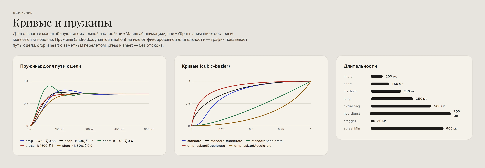
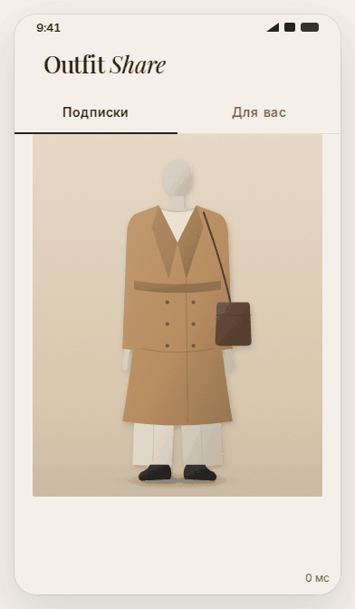
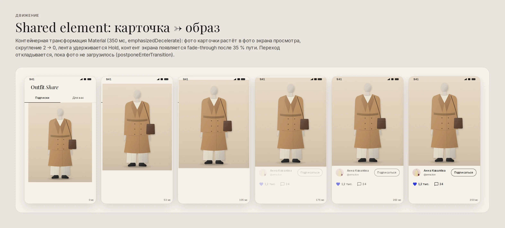
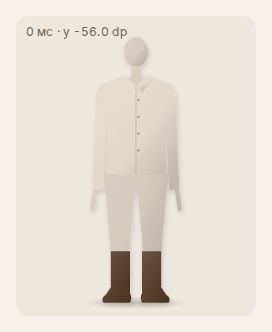
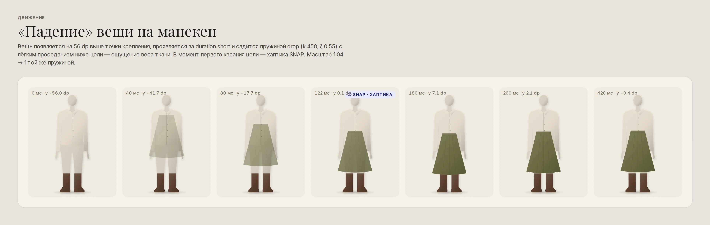
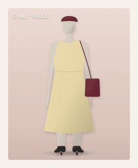
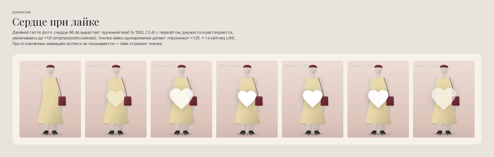

# Движение и хаптика

Движение в Outfit Share физическое и сдержанное: вещь имеет вес, сердце — упругость, переходы
продолжают фото, а не заменяют экраны. Всё берётся из токенов `motion.*` и `haptics.*`
([`tokens.json`](tokens/tokens.json)); в Android — `@integer/ds_motion_duration_*`,
`@interpolator/ds_easing_*`, `DsMotionTokens.SPRING_*`, `DsHapticTokens.*` и помощники `Motion`,
`DropAnimation`, `HeartBurst`, `SharedElements`, `Haptics`.



## Токены

| Длительность | мс | Где |
|---|---|---|
| `micro` | 100 | нажатие, «вдавливание» карточки, пик лайка |
| `short` | 150 | кроссфейд состояний, проявление вещи, появление сердца |
| `medium` | 250 | индикатор табов, баннер, растворение сердца |
| `long` | 350 | shared element «карточка → образ», шторка |
| `extraLong` | 500 | онбординг |
| `heartBurst` | 700 | полный цикл большого сердца |
| `shimmer` | 1400 | цикл блика скелетона |
| `undoWindow` | 5000 | окно «Отменить» в снекбаре |

| Кривая | Где |
|---|---|
| `standard` (0.2, 0, 0, 1) | смена состояния внутри экрана |
| `emphasizedDecelerate` (0.05, 0.7, 0.1, 1) | вход элементов, shared element «туда» |
| `emphasizedAccelerate` (0.3, 0, 0.8, 0.15) | уход, shared element «обратно», растворение сердца |

| Пружина | stiffness | dampingRatio | Где |
|---|---|---|---|
| `drop` | 450 | 0.55 | вещь «падает» на манекен |
| `snap` | 800 | 0.7 | слой примагничивается к опорным точкам |
| `heart` | 1200 | 0.4 | сердце, «пружинка» лайка |
| `press` | 1500 | 1.0 | сжатие без отскока |
| `sheet` | 600 | 0.9 | доводка перетаскиваемых панелей |

Пружины не имеют фиксированной длительности: если пользователь прервёт движение новым жестом,
анимация продолжится от текущей скорости, а не «доиграет» заранее заданную кривую.

## Shared element: карточка → просмотр образа



Контейнерная трансформация Material 350 мс: фото карточки ленты растёт в фото экрана просмотра,
скругление 2 → 0 dp, лента удерживается `Hold` (не мигает под переходом), контент нового экрана
проявляется fade-through после 35 % пути. Возврат — той же трансформацией с `emphasizedAccelerate`.

```java
// Лента, по клику на карточку
SharedElements.holdSource(this);
FragmentNavigator.Extras extras = new FragmentNavigator.Extras.Builder()
    .addSharedElement(card.getPhotoView(), SharedElements.outfitPhoto(outfit.id))
    .build();

// Просмотр образа, onCreate()
SharedElements.setUpDestination(this, R.id.nav_host);
postponeEnterTransition();          // startPostponedEnterTransition() — когда фото загрузилось
```

`transitionName` одинаков во всех источниках (лента, профиль, поиск, коллекции, чат):
`SharedElements.outfitPhoto(id)`.



## «Падение» вещи на манекен со snap



Вещь из каталога размещается в конечной позиции, а `DropAnimation.drop(layer, onLanded)` проигрывает
путь к ней: старт на 56 dp выше и с масштабом 1.04, проявление за 150 мс, посадка пружиной `drop` с
лёгким проседанием ниже цели — ощущение веса ткани. В момент первого касания цели —
**хаптика `SNAP`**. Перетаскиваемый слой, отпущенный рядом с зоной крепления, примагничивается
`DropAnimation.snapTo(layer, x, y, onSnapped)` пружиной `snap`; зона подсвечивается `snapGuide`, хаптика
— в момент захвата.



## Сердце при лайке



Двойной тап по фото: `HeartBurst.play(heart)` — сердце 96 dp вырастает пружиной `heart` с перелётом,
держится и растворяется с увеличением до ×1.6. Одновременно `LikeButton` делает «пружинку» ×1.25 → 1
и **хаптику `LIKE`**. Повторный двойной тап лайк не снимает (снять можно только кнопкой).



## Хаптика

Только на ключевых действиях — вибрация как пунктуация, а не фон. `Haptics.perform(view, event)`
выбирает константу `HapticFeedbackConstants` по цепочке фолбэков для версии Android и уважает
системную настройку «Вибрация при касании».

| Событие | Цепочка (константа@minApi) | Где |
|---|---|---|
| `SNAP` | `SEGMENT_TICK@34` → `CLOCK_TICK@21` | вещь села на манекен, слой примагнитился |
| `LIKE` | `CONFIRM@30` → `VIRTUAL_KEY@21` | лайк (снятие — без вибрации) |
| `PUBLISH` | `CONFIRM@30` → `LONG_PRESS@21` | образ или вещь опубликованы |
| `SHUTTER` | `CONFIRM@30` → `VIRTUAL_KEY@21` | снимок в Студии |
| `REJECT` | `REJECT@30` → `LONG_PRESS@21` | ошибка действия |
| `DRAG_START` | `DRAG_START@34` → `GESTURE_START@30` → `LONG_PRESS@21` | начало перетаскивания слоя или точки |
| `TOGGLE_ON/OFF` | `TOGGLE_ON/OFF@34` → `CLOCK_TICK@21` | переключатели в строках настроек |

## «Убрать анимации» и масштаб анимаций

* Длительности умножаются на системный «Масштаб анимации» автоматически (ValueAnimator,
  ViewPropertyAnimator, переходы).
* При «Убрать анимации» (`ValueAnimator.areAnimatorsEnabled() == false`) компоненты меняют
  состояние мгновенно: вещь сразу на месте (хаптика `SNAP` сохраняется — это обратная связь, а не
  украшение), большое сердце не показывается, скелетон без блика, `StateView` без кроссфейда.
* Движение никогда не несёт единственный смысл: всё, что показывает анимация, видно и в конечном
  состоянии.
