# Экраны

Макеты всех экранов Android-приложения в журнальной эстетике Outfit Share. Собраны из тех же токенов, шрифтов, иконок и иллюстраций, что и модуль `:core:designsystem`, поэтому служат спецификацией для фаз 3–6. На каждой доске: главное состояние в светлой и тёмной теме, все состояния экрана и вариант со шрифтом 200 %. Исходники — [`mockups/screens`](mockups/screens), локальный просмотр — [`mockups/board.html`](mockups/board.html).

## Карта приложения

```mermaid
flowchart LR
  splash[Сплэш] --> onboarding[Онбординг] --> login[Вход: Telegram / код на почту]
  splash -->|есть сессия| feed
  login --> feed
  subgraph tabs[Нижняя навигация]
    feed[Лента] ~~~ search[Поиск] ~~~ create[Создать] ~~~ dialogs[Диалоги] ~~~ profile[Профиль]
  end
  feed -->|shared element| outfit[Просмотр образа] --> comments[Комментарии]
  feed --> notifications[Уведомления]
  outfit --> user[Профиль автора] --> follows[Подписки / подписчики]
  outfit -->|ремикс| constructor
  search --> outfit & user
  create --> constructor[Конструктор] --> publish[Публикация]
  dialogs --> chat[Чат]
  profile --> edit[Редактирование] & collections[Коллекции] & settings[Настройки] & follows
  profile -->|админ| camera[Студия: камера] --> queue[Очередь] --> review[Проверка] --> keypoints[Доводка точек] --> itempub[Публикация вещи]
  review --> itempub
```

## Матрица состояний

Каждый экран проектируется в пяти обязательных состояниях помимо контента. **Жирным** — состояние есть на доске экрана; обычным текстом — правило поведения, для которого отдельный макет не нужен (используется общий паттерн).

| Экран | Загрузка | Пусто | Ошибка сети (с «Повторить») | Офлайн | Нет прав |
|---|---|---|---|---|---|
| [Сплэш](#splash) | **обложка с прогрессом** (не дольше 600 мс без сети) | — | сессия проверяется из кэша, ошибка → вход | есть сессия — лента из кэша | — |
| [Онбординг](#onboarding) | — | — | — | работает без сети (статичен) | — |
| [Вход](#login) | **«Ждём подтверждения в Telegram…»**, «Проверяем…» | — | **неверный код** + «Отправить новый код» | **баннер, кнопки недоступны** | — |
| [Лента](#feed) | **скелетон ленты** | **нет подписок** → «Для вас», «Найти людей» | **«Лента не загрузилась»** | **кэш + баннер**; **без кэша** — StateView | — |
| [Просмотр образа](#outfit) | **скелетон** | — | **«Образ не загрузился»** | **кэш + баннер**, лайк уходит позже | **«Образ недоступен»** (скрыт/только подписчикам) |
| [Комментарии](#comments) | **скелетон строк** | **«Пока тихо»** | **в шторке** + «Повторить»; **не отправлено** — у сообщения | отправка в очередь | комментарии выключены автором → строка вместо поля |
| [Конструктор](#constructor) | **скелетон каталога** | **пустой холст** с подсказкой | снекбар ошибки на действии | **каталог из кэша + баннер** | — |
| [Публикация образа](#publish) | **«Публикуем…»** | **пустая подпись** (необязательна) | **снекбар + черновик сохранён** | **«Опубликовать позже»** | — |
| [Профиль (свой)](#profile) | **скелетон** | **«Соберите первый образ»** | **«Профиль не загрузился»** | **кэш + баннер** | — |
| [Профиль (чужой)](#user) | скелетон как у своего профиля | нет образов — как у своего | **«Профиль не загрузился»** | **кэш + баннер** | **закрытый профиль**, **заблокирован** |
| [Редактирование профиля](#profile-edit) | **«Готово» с индикатором** | — | **имя занято** + свободные варианты | **баннер**, сохранится позже | — |
| [Подписки и подписчики](#follows) | **скелетон строк** | **«Пока никого»** | **«Список не загрузился»** | **кэш + баннер** | закрытый профиль → состояние «нет прав» профиля |
| [Поиск](#search) | **скелетон сетки** | **«Ничего не нашлось»** + теги | **«Поиск не ответил»** | **«Поиск без сети не работает»** | — |
| [Коллекции](#collections) | **скелетон обложек** | **«Сохраняйте образы»** | **«Коллекции не загрузились»** | **кэш + баннер** | чужая приватная — не показывается, своя — с замком |
| [Уведомления](#notifications) | **скелетон строк** | **«Пока тихо»** | **«Не загрузились»** | **кэш + баннер** | **push выключены в системе** → «Включить» |
| [Диалоги](#dialogs) | **скелетон строк** | **«Пока нет диалогов»** | **«Диалоги не загрузились»** | **кэш + баннер** | — |
| [Чат](#chat) | **скелетон пузырей** | **новый диалог** с подсказками | **«Не отправлено · Повторить»** | **очередь (часы вместо галочек)** | собеседник ограничил сообщения → строка вместо поля |
| [Настройки](#settings) | — | — | ошибка сохранения — снекбар, значение откатывается | **баннер**, изменения локально | **push выключены в системе** |
| [Студия: камера](#studio-camera) | инициализация камеры — чёрный экран с затвором disabled | — | ошибка камеры → StateView с «Повторить» | съёмка работает, загрузка встаёт в очередь | **нет доступа к камере**, **не администратор** |
| [Студия: очередь](#studio-queue) | **скелетон строк** | **«Очередь пуста»** | **ошибка вещи в строке** + «Переснять» | **«Загрузка на паузе»** | не администратор — как у камеры |
| [Студия: проверка](#studio-review) | **«Ещё обрабатывается»** с шагами | — | **низкая посадка** — «Далее» недоступна | **кэш + баннер** | — |
| [Студия: доводка точек](#studio-keypoints) | — | — | — | правка локально, отправка после сети | — |
| [Студия: публикация вещи](#studio-publish) | **«Публикуем…»** | — | **снекбар + вещь в очереди** | **«Опубликовать, когда появится сеть»** | — |

Общие паттерны: загрузка — скелетон формы контента (не спиннер на весь экран); пусто — иллюстрация, объяснение и следующий шаг; ошибка — причина человеческим языком и «Повторить»; офлайн с кэшем — баннер над сохранённым, без кэша — StateView «Нет подключения»; нет прав — замок, объяснение и действие («Разрешить», «Открыть настройки», «Отправить заявку»). См. [`components.md`](components.md#состояния-экрана--stateview-и-screenstate).

## Вход

<a id="splash"></a>
### Сплэш

Системный Splash Screen (Android 12+) показывает знак-вешалку на фоне темы, затем — журнальная «обложка» с вордмарком, пока грузится сессия (не дольше duration.splashMin без сети).

Состояния: Обложка · Системный сплэш.

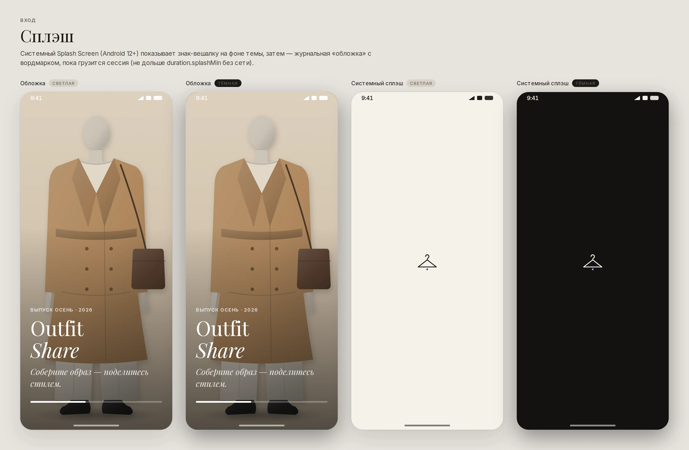

<a id="onboarding"></a>
### Онбординг

Три разворота журнала: фото сверху, крупный заголовок антиквой, одна мысль на экран. «Пропустить» всегда доступно; свайп и кнопка «Далее» равнозначны.

Состояния: Шаг 1 · Шаг 2 · Шаг 3.

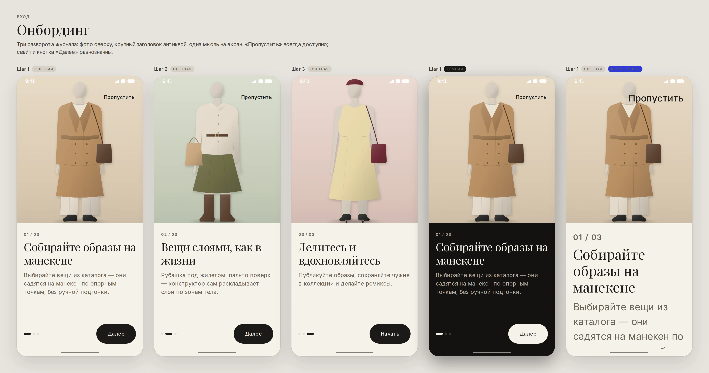

<a id="login"></a>
### Вход

Два пути: через Telegram-бота (основной, одна кнопка) и одноразовый код на почту. Кнопки не прыгают по ширине в состоянии загрузки; ошибки — текстом у поля, не только цветом.

Состояния: Выбор способа · Ввод почты · Ждём Telegram · Код · Неверный код · Офлайн.

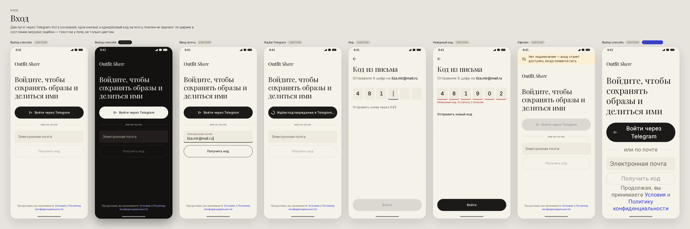

## Основное

<a id="feed"></a>
### Лента

Фото образа — главный герой: 4:5 на всю ширину колонки, интерфейс вокруг — монохромный. Двойной тап по фото — лайк с большим сердцем; тап — просмотр образа через shared element. Вкладки «Подписки / Для вас».

Состояния: Контент · Загрузка · Пусто: нет подписок · Ошибка сети · Офлайн с кэшем · Офлайн без кэша.

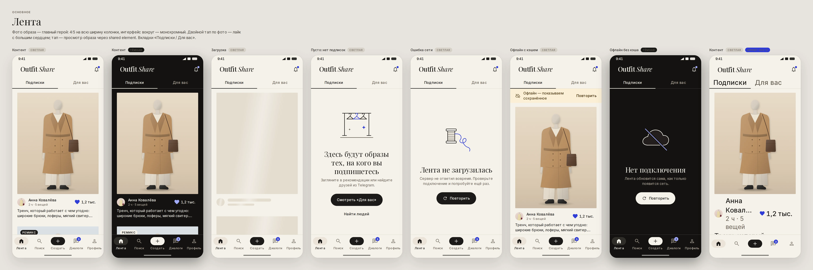

<a id="outfit"></a>
### Просмотр образа

Фото приходит из карточки ленты shared element-переходом (container transform, 350 мс, emphasized). Над фото — только круглые кнопки на полупрозрачной подложке, контраст не зависит от снимка. Ниже — автор, действия, подпись, вещи образа и похожие образы.

Состояния: Контент · Двойной тап: лайк · Прокрутка: вещи · Шторка «Ещё» · Сохранено + снекбар · Загрузка · Ошибка сети · Нет доступа · Офлайн с кэшем.

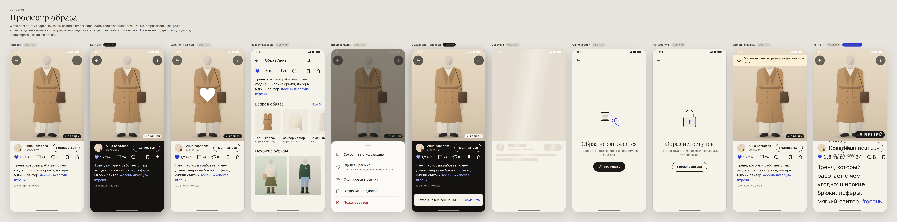

<a id="comments"></a>
### Комментарии

Bottom sheet поверх образа: фото остаётся видимым сверху. Ответы — с отступом, автор образа помечен бейджем. Удаление — сразу, со снекбаром «Отменить»; неотправленный комментарий остаётся в списке с «Повторить».

Состояния: Контент · Ввод · Пусто · Загрузка · Не отправлено · Удалено + «Отменить» · Ошибка сети.

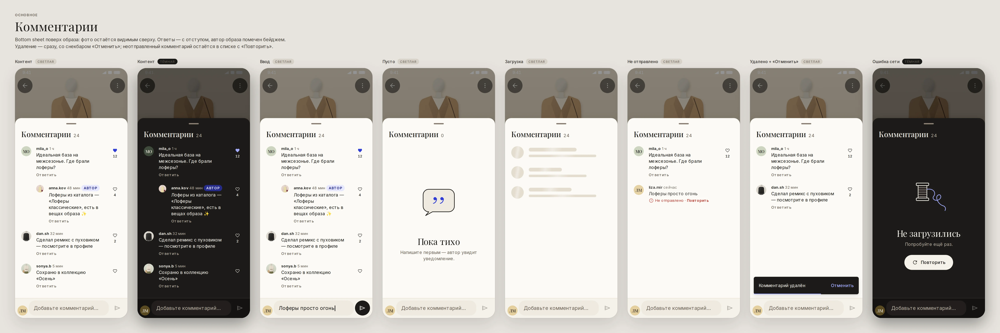

## Создание

<a id="constructor"></a>
### Конструктор

Холст — студийная «бумага» (canvas), каталог — в нижней панели. Вещь из каталога «падает» на манекен пружиной drop и садится по опорным точкам; при перетаскивании зона крепления подсвечивается акцентом, в момент захвата — хаптика SNAP. Выбранный слой — рамка цвета selection с ручками 48 dp зоны касания.

Состояния: Выбран слой · Пустой холст · Перетаскивание: snap · Шторка слоёв · Слой удалён + «Отменить» · Загрузка каталога · Офлайн.

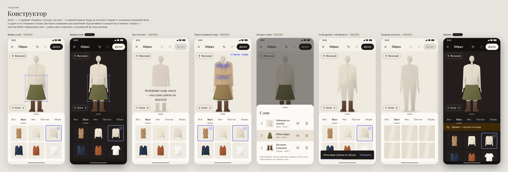

<a id="publish"></a>
### Публикация образа

Превью, подпись, хэштеги с подсказками, коллекция и видимость. Кнопка «Опубликовать» уходит в состояние загрузки, ширина не меняется; по успеху — хаптика PUBLISH и экран-подтверждение. Без сети образ сохраняется черновиком и публикуется сам.

Состояния: Форма · Пустая подпись · Публикуем · Ошибка + повтор · Офлайн · Опубликовано.

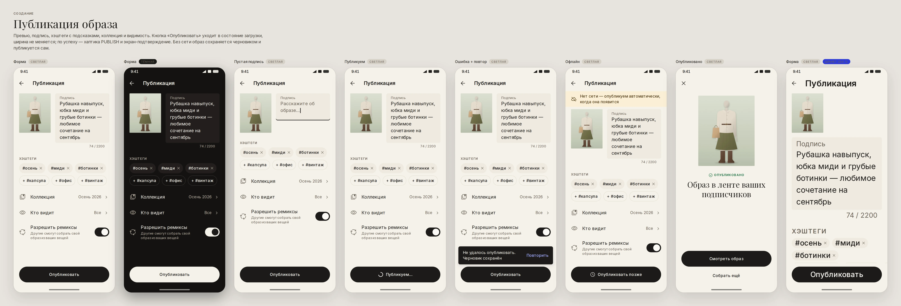

## Профиль

<a id="profile"></a>
### Профиль (свой)

Обложка журнала о себе: крупный аватар, счётчики набраны антиквой, сетка образов 3×N без зазоров-«рамок». Вкладки: образы, коллекции, черновики. Черновики, не ушедшие без сети, помечены бейджем.

Состояния: Образы · Черновики · Пусто · Загрузка · Офлайн с кэшем · Ошибка сети.

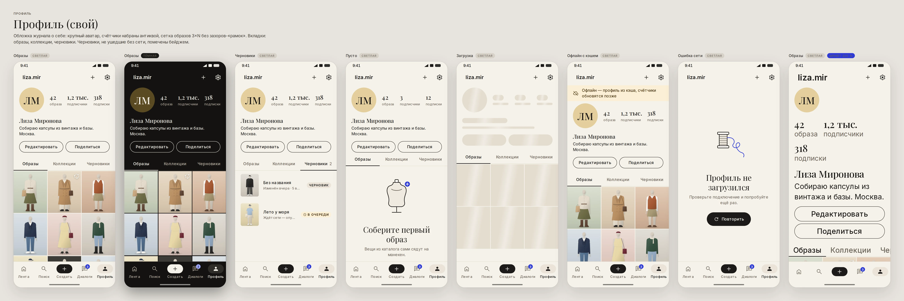

<a id="user"></a>
### Профиль (чужой)

Главное действие — «Подписаться» (primary). После подписки кнопка становится secondary «Вы подписаны» — действие обратимо без подтверждения. Закрытый профиль и блокировка — отдельные состояния «нет прав».

Состояния: Не подписаны · Подписаны · Закрытый профиль · Заблокирован · Офлайн с кэшем · Ошибка сети.

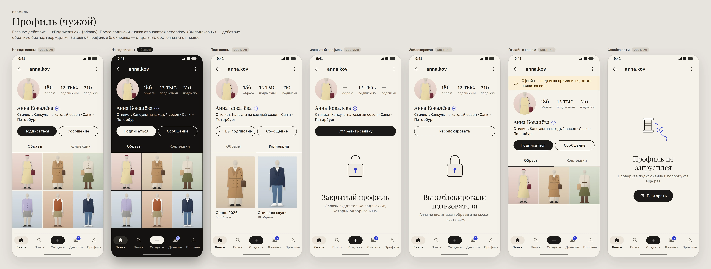

<a id="profile-edit"></a>
### Редактирование профиля

«Готово» активна только при изменениях. Ошибка имени пользователя — текстом под полем и подсказками свободных вариантов. Смена фото — bottom sheet; удаление фото — разрушающее действие цвета danger.

Состояния: Форма · Имя занято · Сохранение · Шторка фото · Офлайн.

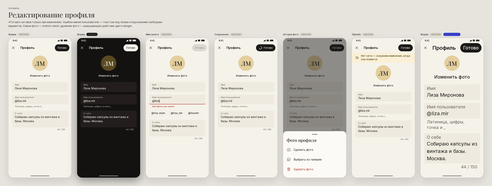

<a id="settings"></a>
### Настройки

Большой заголовок антиквой, группы с кикерами. Переключатель управляется всей строкой (одна цель касания, одна фраза для TalkBack). Выход и удаление — цветом danger и только через диалог подтверждения: у них нет «Отменить».

Состояния: Контент · Выбор темы · Подтверждение выхода · Push выключены (нет прав) · Офлайн.

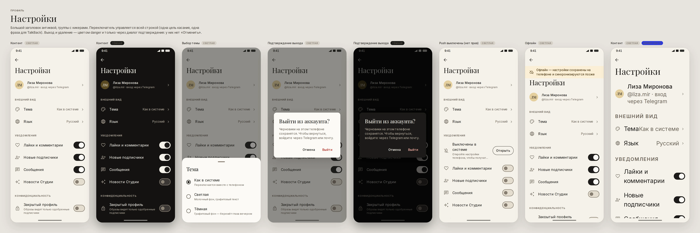

## Люди

<a id="follows"></a>
### Подписки и подписчики

Две вкладки со счётчиками, поиск по списку. Кнопка в строке меняет вид, а не цвет: primary «Подписаться» → secondary «Вы подписаны». Взаимность — текстом в подзаголовке.

Состояния: Подписчики · Поиск по списку · Пусто · Загрузка · Ошибка сети · Офлайн с кэшем.

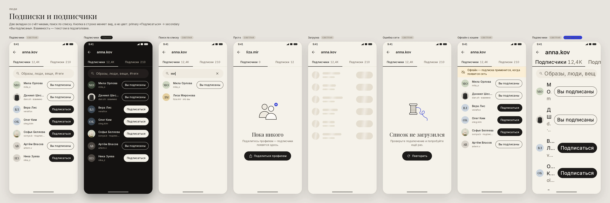

<a id="search"></a>
### Поиск

До ввода — недавнее, тренды и люди; после — фильтр-чипы «Образы · Люди · Вещи · Теги» (выбор — инверсная заливка, не только цвет) и результаты. Ничего не нашлось — подсказка переформулировать и популярные теги.

Состояния: До ввода · Результаты: образы · Результаты: вещи · Ничего не найдено · Загрузка · Ошибка сети · Офлайн.

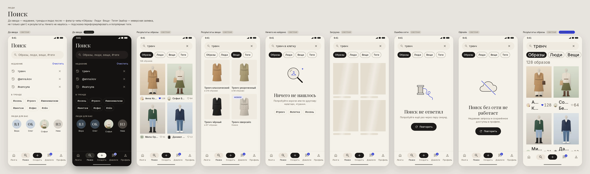

<a id="collections"></a>
### Коллекции

Обложка коллекции — мозаика 2×2 из последних образов. «Сохранённое» создаётся автоматически. Приватные коллекции помечены замком (иконка + текст для TalkBack).

Состояния: Список · Коллекция · Пусто · Новая коллекция · Загрузка · Офлайн с кэшем · Ошибка сети.

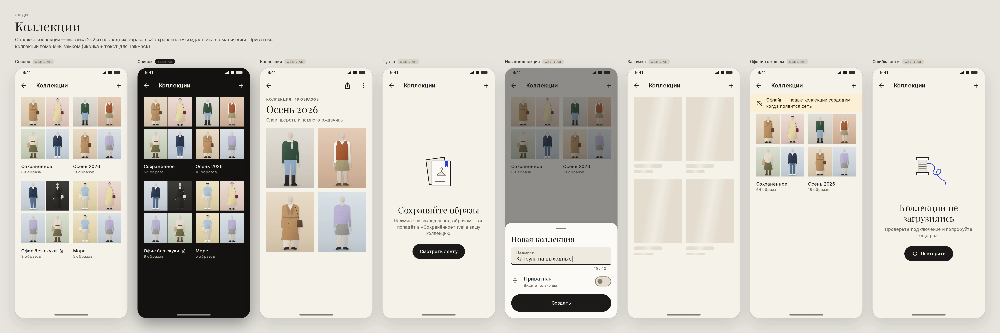

<a id="notifications"></a>
### Уведомления

Группы «Новые / На этой неделе / Раньше». Непрочитанное — точка акцента слева и жирное имя. Однотипные события схлопываются («и ещё 12»). Если push выключены в системе — баннер с переходом в настройки (состояние «нет прав»).

Состояния: Контент · Push выключены · Пусто · Загрузка · Офлайн с кэшем · Ошибка сети.

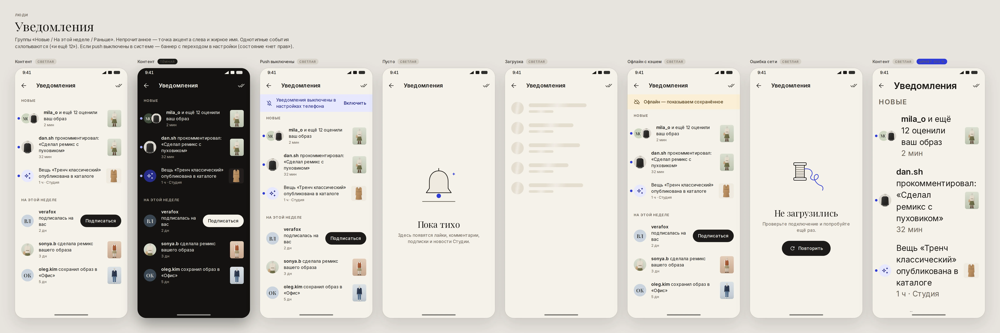

## Сообщения

<a id="dialogs"></a>
### Диалоги

Закреплённые сверху, затем по времени. Непрочитанное — счётчик акцентного цвета (число, не только цвет), прочитанное — двойная галочка. Поделённый образ — иконка вешалки перед текстом. «Печатает…» — акцентом, обновляется в реальном времени через WebSocket.

Состояния: Контент · Пусто · Загрузка · Офлайн с кэшем · Ошибка сети.

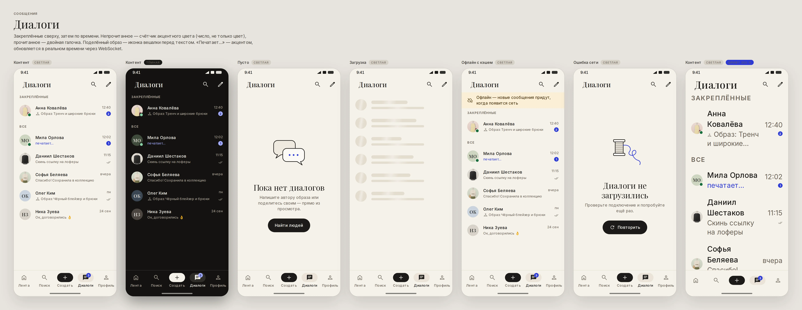

<a id="chat"></a>
### Чат

Входящие — тональная поверхность, исходящие — primary (графит/молочный), хвостик — радиус bubbleTail. Поделённый образ — карточка с фото прямо в ленте сообщений. Неотправленное остаётся на месте с «Повторить»; без сети сообщение встаёт в очередь (часы вместо галочек).

Состояния: Контент · Собеседник печатает · Не отправлено · Офлайн: очередь · Новый диалог · Загрузка.

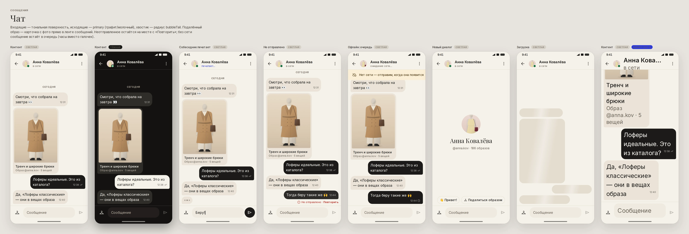

## Студия

<a id="studio-camera"></a>
### Студия: камера

Камера всегда в тёмной палитре (ThemeOverlay.Ds.Dark), независимо от темы телефона. Проверки качества — живые чипы поверх кадра: свет, фон, кадрирование; предупреждение — иконкой и текстом. Затвор 72 dp, хаптика SHUTTER. Без прав камеры и для не-админов — состояния «нет прав».

Состояния: Готово к съёмке · Мало света · Снимок · Нет доступа к камере · Не администратор.

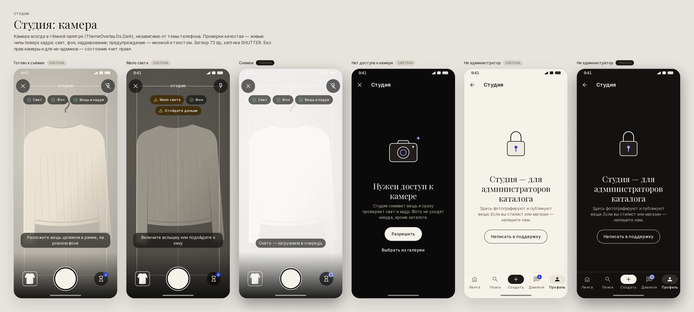

<a id="studio-queue"></a>
### Студия: очередь

Живой прогресс по WebSocket: загрузка — процент и мегабайты, обработка — шаги пайплайна (фон → контур → опорные точки → посадка → превью). Готовое — с fit score, ошибка — с понятной причиной и действием. Загрузка в фоне переживает закрытие экрана.

Состояния: В работе · Пусто · Офлайн: пауза · Загрузка.

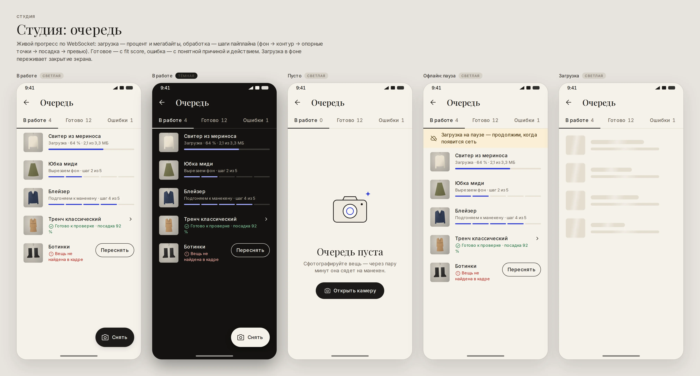

<a id="studio-review"></a>
### Студия: проверка

«До / После»: исходный кадр и вещь, посаженная на манекен. Fit score — бейдж со значком и числом (не только цвет). При низкой посадке проблемная зона подсвечивается warning, «Далее» недоступна до доводки точек. Категория, слой и зоны определены пайплайном и редактируются чипами.

Состояния: После: хорошая посадка · До: исходный кадр · Низкая посадка · Ещё обрабатывается · Офлайн.

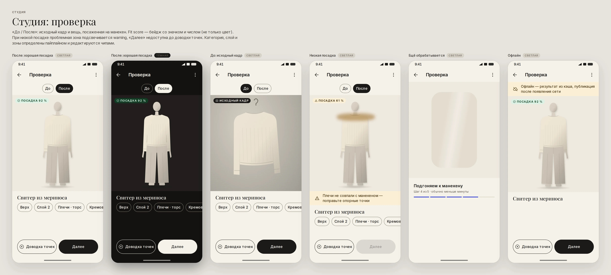

<a id="studio-keypoints"></a>
### Студия: доводка точек

Опорные точки вещи (плечи, воротник, талия, низ) перетаскиваются пальцем; маркер 28 dp, зона касания 48 dp. Активная точка — акцентом и лупой, чтобы палец не закрывал край ткани. Полупрозрачный манекен под вещью показывает, куда точка «сядет». Каждое перемещение — в undo.

Состояния: Точки · Перетаскивание + лупа.

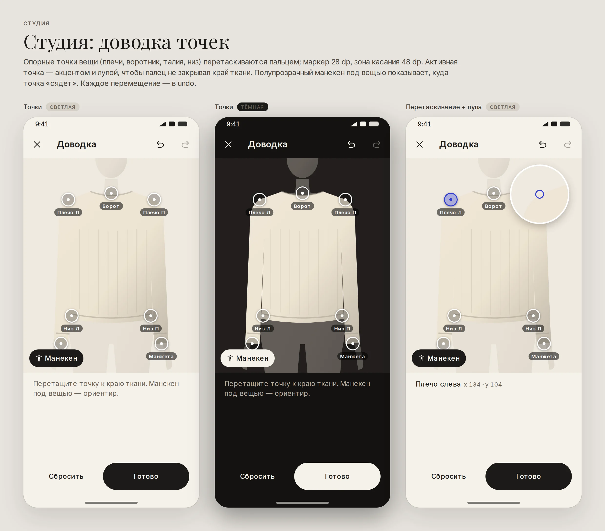

<a id="studio-publish"></a>
### Студия: публикация вещи

Атрибуты предзаполнены пайплайном — администратор только проверяет. Цвет — образцы с кольцом выбора (форма, а не только цвет). После публикации вещь сразу доступна всем в конструкторе: подтверждение показывает её на манекене, хаптика PUBLISH.

Состояния: Форма · Публикуем · Опубликовано · Ошибка · Офлайн.

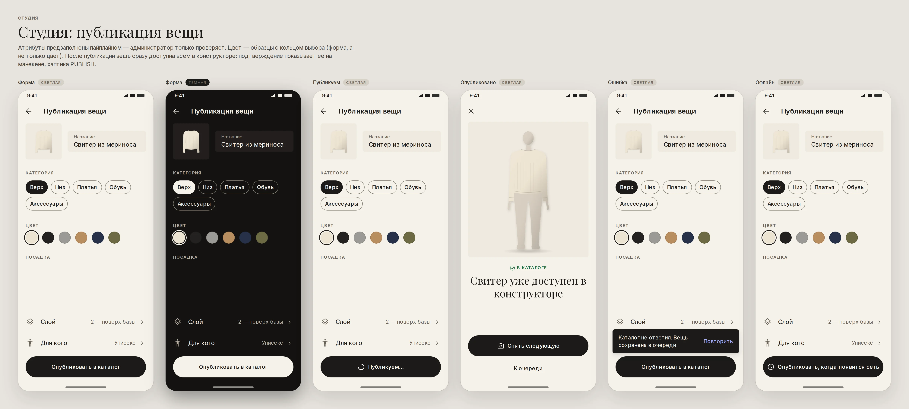
